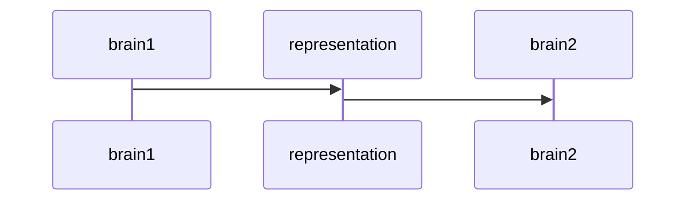
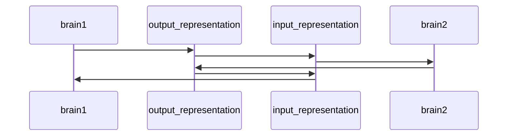
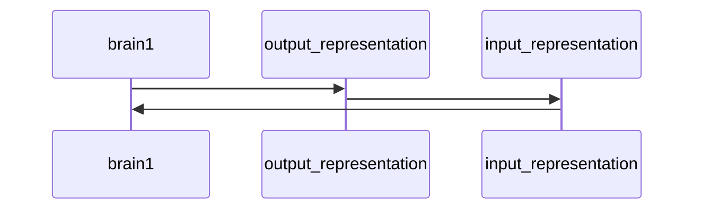
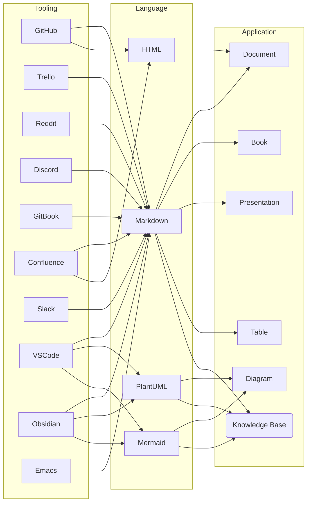
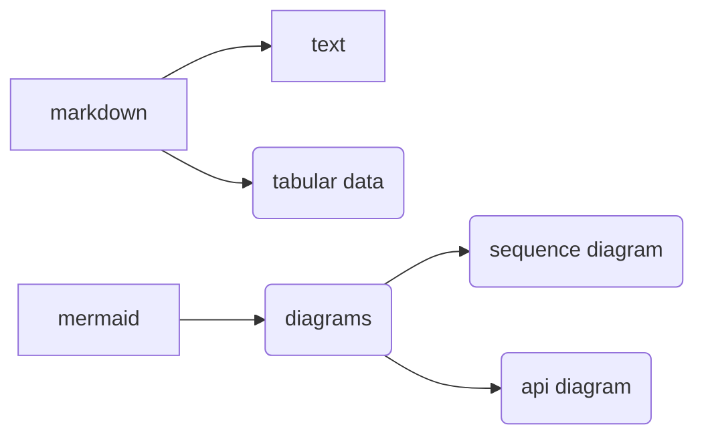
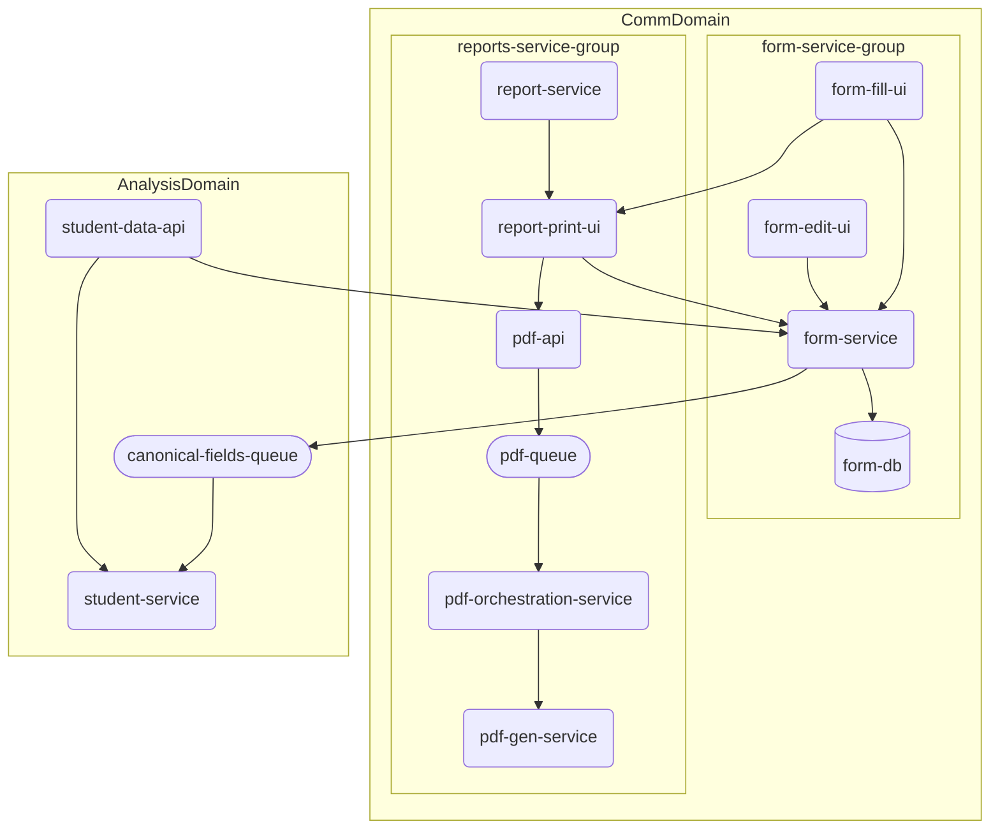
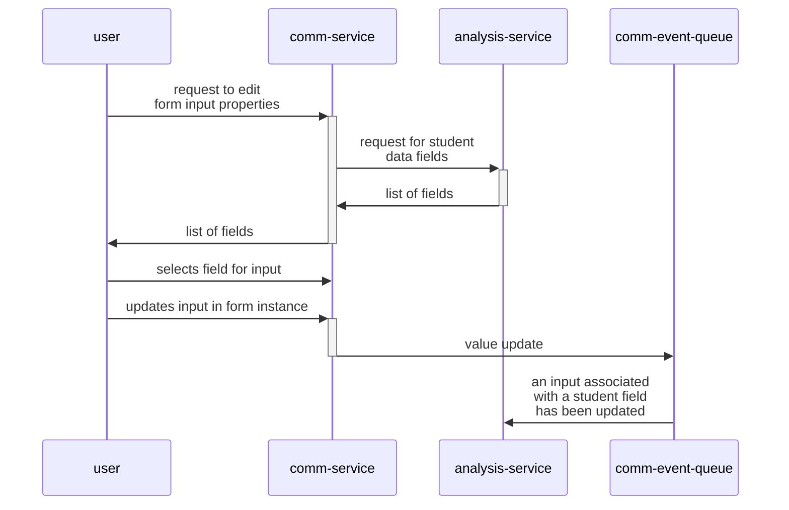
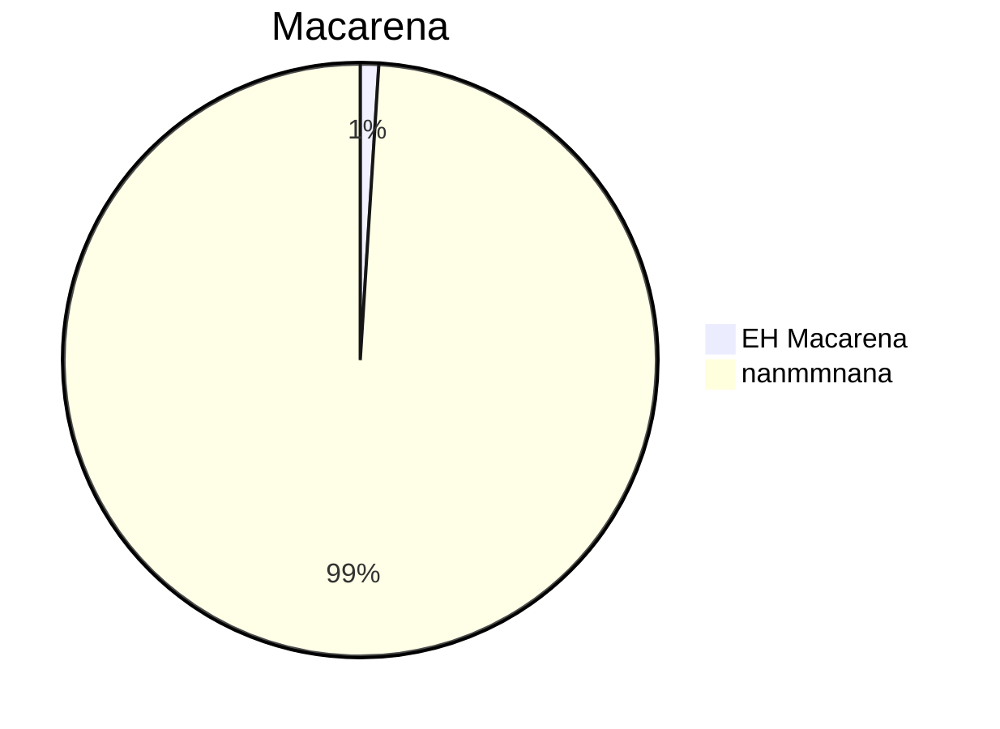
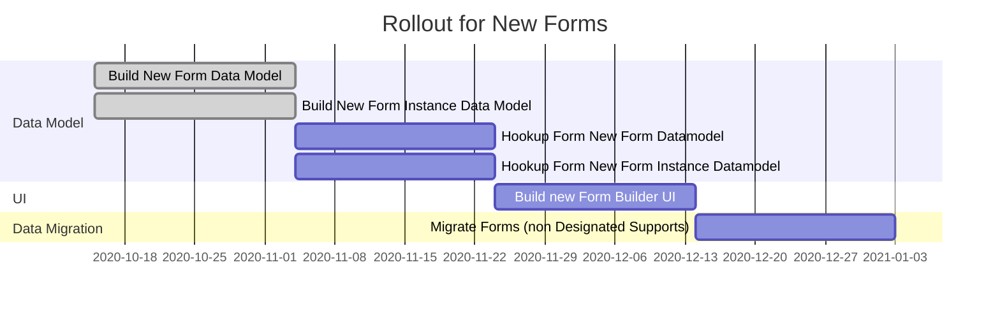

# Wonderful world of markup languages

---

## Motivation
- Increasing the bandwidth for information to flow within the organization means we can reach consensus faster and be more productive.
- This is an approach to improve latency from concept to technical design.

---

## Thesis

Reducing the cost of communication makes it more likely that when faced with ambiguity, you will chose further communication over trusting assumptions.

Examples of Cost Include *Time* and *Cognitive Load (Complexity)*

Markup languages can reduce the cognitive load of communicating by focusing on content

---

## Representation
- **Imperative**: A series of steps that each makes an incremental change describing ***HOW*** to arrive at a specific model/representation. The model/representation is defined by the series of steps.
- **Declarative**: A statement of ***WHAT*** a model/representation is modeling. 

---

### Imperative Representations
- Examples:
	- photoshop, diagram.io, cooking recipie, git history, database migrations
- How we update our model and associated representations:
	- apply new steps or revert old steps (if you can, darn you entropy!)

---

### Declarative Representations
- Examples:
	- file in a filesystem (image, diagram, text)
	- markup languages (ex. HTML)
- How we update our model and associated representation:
	- "direct" manipulation

---

### Hold up

Direct manipulation doesn't exist but we can simplify the interface to reduce cognitive load and remove as many decisions as possible for the user to keep a flow state.

---

### Quick Check
Do I specify **WHAT** something is or **HOW** to arrive at something.

---

Relation to functional programming from previous:
mutation => imperative

  ---

### Processes are imperative
- Even to create a declarative representation, you take steps to build it up from nothing
- By reducing the complexity of the imperative part of the process, more of the information you are expressing directly describes the model

---

## Simplified Interface => "More" Declarative

---

## Communication
- When we create, we realize an external representation of an internal representation
	- To write new code you first have to a model in my head that contains some of the information ultimately that will end up in the code.
    - Often this is an iterative process
	  - ```mermaid
        graph LR; create --> learn; learn --> create
    - Through which we hone our internal and external models together

---

### Communication Patterns - brain2brain (the real b2b)


- Using the same representation for input and output from brains
- 
---

### Communication Patterns - brain2comp2brain

Where:
- output_representation is optimized for human output
- input_representation is optimized for input to human

---

### Communication Patterns - brain2comp2self

Where:
- output_representation is optimized for human output
- input_representation is optimized for input to human

---


### Communication Complexity
- We all know how to type, and with a few pieces of syntax, the interface to utilize Markdown (for ex.) is more accesible than learning most GUI's
- By offloading layout to algorithms, and formatting to style sheets (declarative) we reduce the complexity of expressing the content of our ideas.

---
## Markup
-Wikipedia:
>In computer text processing, a **markup language** is a system for [annotating](https://en.wikipedia.org/wiki/Annotation "Annotation") a [document](https://en.wikipedia.org/wiki/Document "Document") in a way that is [syntactically distinguishable](https://en.wikipedia.org/wiki/Syntax_(logic) "Syntax (logic)") from the text,[\[1\]](https://en.wikipedia.org/wiki/Markup_language#cite_note-1) meaning when the document is processed for display, the markup language is not shown, and is only used to format the text.[](https://en.wikipedia.org/wiki/Markup_language#cite_note-2)

---

## Lets get meta 
 &nbsp


---
## Ecosystem

---
## Markdown
---
### Everybody markdowns
Github, Confluence, Slack
- Text is easily versioned controlled w/ code (Great for Documenting!)
- Don't worry about formatting (concision)
- Known interface (text)
- Compatible

---
### Family


---
## Mermaid
### Diagram Types
#### flow


#### sequence


#### pie chart


#### gannt

---

## PlantUML

Examples

---

## Resources/Tools
- [Mermaid Live Editor](https://mermaid-js.github.io/mermaid-live-editor)
- [PlantUML Docs](https://plantuml.com/)
- Great list of markdown resources: [awesome-markdown](https://github.com/mundimark/awesome-markdown)
- [Markdown Guide List of Tools](https://www.markdownguide.org/tools/)

---

## Food for thought about representations
- [Bret Victor - The Humane Representation of Thought](https://www.youtube.com/watch?v=agOdP2Bmieg)
